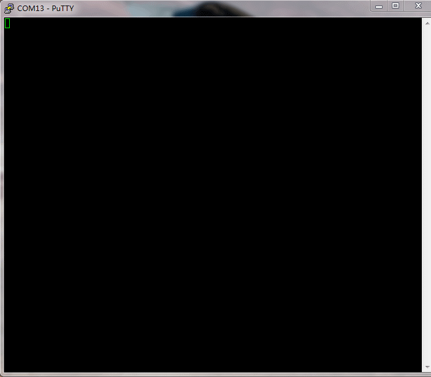

# Introduction
FreeRTOS-Shell is a Shell for [FreeRTOS](https://www.freertos.org/), like Linux Shell or Windows CMD. 

### Why this?

For many embedded applications, there is few way to inactive with your application once it run and that makes things difficult. A shell provide the possibility to inactive with your application, you could use it to do many jobs, such as: 

- Execute function by your command 
- Show running log 
- Do unit test
- Show FreeRTOS system infomation, like task status、mutex status
- Provide a simple operation interface for other person to use, like Test Engineer、Hardware Engineer、Production Engineer.


<br />



# How to use 

the usage is simple, you just need three steps: 
- install:  
>Add essential files to your project, depending on your develop enviroment, there are different ways to implent this.
- port:   
>FreeRTOS-shell use UART to implent INPUT and OUTPUT, you may want use your own uart settings, so your should PORT little code to adapt your boards.
- start: 
> Start the shell.

## Install
1.STM32CubeMX

TODO: https://community.st.com/s/feed/0D53W00000Cg0y8SAB

2.From source
  
 Download this reposity by using git clonem or click Download ZIP. Add 3 files to your project: `FreeRTOS_CLI.c` 、`FreeRTOS_Shell.c` 、`FreeRTOS_Shell_port.c`

## Port

Modify the code in `FreeRTOS_Shell_port.c`, there are only 3 functions you should port:

```
/**
 * @brief: this function output characters to UART
 * @param: buffer, the buffer to characters
 * @param: length, the length of buffer
 */
void FreeRTOS_ShellOutput(const char * buffer, int length);

/**
 * @breif: this is the interrupt handle for uart,
 *         Your should call FreeRTOS_ShellIRQHandle(data) every time when 
 *         receive a data.
 */
void USART2_IRQHandler(void);

/**
 * @breif: this function is defined as __WEAK, and will be called when the shell task start, you could redefine this function to do some initialization work.
 */
void FreeRTOS_Shell_init(void);
```

## Start
```
/* Just create a simple FreeRTOS task */
osThreadId_t ShellHandle;
const osThreadAttr_t Shell_attributes = {
  .name = "Shell",
  .priority = (osPriority_t) osPriorityNormal1,
  .stack_size = 128 * 4
};
ShellHandle = osThreadNew(FreeRTOS_Shell, NULL, &Shell_attributes);
```


# Features
- fast command register, out of user logic,
  
  >you could register command by using `FREERTOS_SHELL_CMD_REGISTER` out of any function.
  ```
  static BaseType_t listAllThread(char *pcWriteBuffer, size_t xWriteBufferLen, const char *pcCommandString){
    ...
  }

  FREERTOS_SHELL_CMD_REGISTER("ps", "list all thread", listAllThread, 0);
  ```
- modifiable logo 
  
  >generate your own logo here: http://www.network-science.de/ascii/. and then replace the macro FREERTOS_SHELL_START_LOGO in `FreeRTOS_Shell.h`

- modifiable logo username
  
  >modify the macro FREERTOS_SHELL_USER_INFO in `FreeRTOS_Shell.h`

- ...more features in development


# How a shell work?

A shell works as parse user INPUT、run functions and then OUTPUT the result. A Shell could be implented by different ways, as long as your application could provide an interface which could INPUT and OUTPUT. For convinence, most shell using [UART](https://en.wikipedia.org/wiki/Universal_asynchronous_receiver-transmitter).

# TODO

  1.适配GCC编译器<br/>
  2.增加更多的FreeRTOS内置API<br/>
  3.增加线程hardfault信息打印<br/>
  4.增加STM32CubeMX包<br/>
  5.测试更多芯片<br/>
  6.增加example项目


# Thanks
RT-thread <br/>
FreeRTOS-CLI